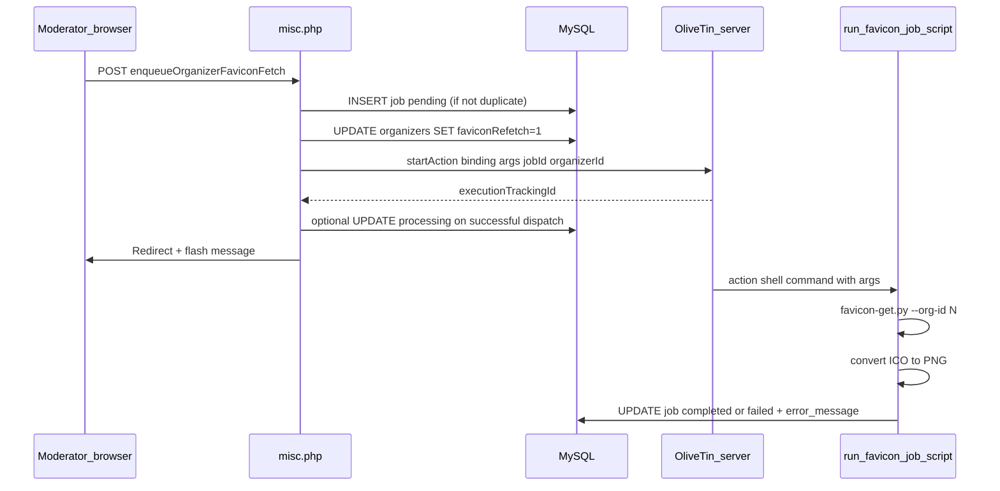

# Favicon-fetch async job queue (OliveTin-driven)

Implementation checklist derived from planning session:

- [ ] Add `jwread/olivetin-bindings-php` via Composer; add `includes/functionality/olivetin.php` with `lanlistOliveTinClient()` only (not pulled from common.php); document OLIVETIN_* in README/example
- [ ] Add `favicon_fetch_jobs` (+ upgrade SQL + schema.sql), InnoDB, indexes on (organizer_id,status) and status+id
- [ ] misc.php action: privilege check, deduped INSERT, set faviconRefetch=1, dispatch via lazy `lanlistOliveTinClient()` startAction(bindingId), handle OliveTinApiException, redirect+message; no client in common.php
- [ ] moderation.tpl + moderation.php assigns: enqueue control + optional pending/dispatched status query
- [ ] scripts/run-favicon-job.sh (or .py): accepts job id + organizer id, runs favicon-get.py --org-id, single ICO→PNG convert, updates job row completed/failed; invoked only by OliveTin
- [ ] Ops docs: sample OliveTin config.yaml action with arguments (jobId, organizerId), bearer/JWT wiring, MYSQL_* env for the runner, no cron poller

---

## Current behaviour (baseline)

- Python [`scripts/favicon-get.py`](../scripts/favicon-get.py) downloads `{org_id}.ico` under the **`scripts/`** working directory (per [`scripts/Makefile`](../scripts/Makefile)).
- [`scripts/favicon-build.sh`](../scripts/favicon-build.sh) runs ImageMagick over `*.ico` and writes PNGs under `public/resources/images/organizer-favicons/{id}.png`.
- `organizers.faviconRefetch` forces deletion of existing ICO before fetch; Python clears the flag on successful download path only (warnings/errors leave the flag behaviour as today).
- [`public/scheduler.php`](../public/scheduler.php) handles **scheduled PHP tasks** (`scheduler_tasks`); favicon draining stays in the **`scripts/`** Python/ImageMagick toolchain.

## Target design

Jobs are **dispatched asynchronously** by [OliveTin](https://github.com/OliveTin/OliveTin) (not cron). The lanlist PHP app triggers execution through **[OliveTin-bindings-php](https://github.com/OliveTin/OliveTin-bindings-php)** (Composer package **`jwread/olivetin-bindings-php`**) using the **`OliveTinClient::startAction`** fire-and-forget RPC (bearer token or JWT depending on OliveTin config).

Typical OliveTin client usage (bindings README):

```php
use OliveTin\Api\OliveTinClient;

$client = lanlistOliveTinClient(); // defined in a dedicated include; NOT constructed in common.php
$started = $client->startAction(
    bindingId: 'your-binding-id',
    arguments: ['organizerId' => '123', 'jobId' => '456'],
);
```

Requirements: PHP 8.1+, `curl`, `json` (matches OliveTin client). Ensure repo `composer.json` PHP constraint is compatible.



**Dispatch vs execution**: OliveTin returns after **accepting** the action (`startAction` is non-blocking for completion—see bindings `startAction` vs `startActionAndWait`). Use **`startAction`** so the moderator request finishes quickly; **`startActionAndWait`** could block too long behind HTTP timeouts and is not intended for favicon crawling.

**Why still set `faviconRefetch=1` on enqueue**: same as before—forces ICO delete/refetch path in `process_organizer_row` inside [`scripts/favicon-get.py`](../scripts/favicon-get.py). Optional later: a Python `--force` flag to skip toggling organizer flags.

### Failure semantics

If **`startAction` throws** [`OliveTinApiException`](https://github.com/OliveTin/OliveTin-bindings-php): keep DB job row **`pending`** (or **`failed`** with `"dispatch: …"`—pick one convention and apply consistently); do not claim the job succeeded. Optionally log to existing [`logs`](../schema.sql) table.

**Stuck rows** (OliveTin down, rejected action): no cron recovery in this plan; operators use OliveTin execution UI/logs and moderation UI to reconcile, or add a manual “retry dispatch” later.

---

## 1. Schema

Unchanged intent: **`favicon_fetch_jobs`** (**`InnoDB`**) with `pending` → `processing` (optional after successful dispatch to OliveTin) → `completed` / `failed`; dedupe duplicate `pending`/`processing` rows per organizer in PHP.

Deliverables:

- Update [`schema.sql`](../schema.sql).
- Incremental **`scripts/`** migration SQL beside [`scripts/add_organizer_faviconRefetch.sql`](../scripts/add_organizer_faviconRefetch.sql).

---

## 2. Dependencies and configuration

- **`composer require jwread/olivetin-bindings-php`** in this repo ([`composer.json`](../composer.json)).
- Add non-secret placeholders in config pattern used by lanlist (`includes/config.php` is local—document **`OLIVETIN_BASE_URL`** and **`OLIVETIN_TOKEN`** or JWT source in **`README.md`** / example snippet). Optionally define thin `OLIVETIN_BINDING_ID` for the favicon action binding constant to avoid scattering magic strings.

### 2b. Lazy OliveTin client (no `common.php` construction)

[`public/includes/common.php`](../public/includes/common.php) loads on **every web request**. **Do not** construct **`OliveTinClient`** there or `require_once` OliveTin binding classes globally.

Implement **on-demand** construction via a dedicated function—for example **`lanlistOliveTinClient(): OliveTinClient`** in **`public/includes/functionality/olivetin.php`** (name as fits existing folder conventions—that file only holds the factory/helper).

- **`require_once`** that file **only from entry points that enqueue** (initially [`public/misc.php`](../public/misc.php) inside the **`enqueueOrganizerFaviconFetch`** branch immediately before **`startAction`**), **not** from **`common.php`**.
- **`lanlistOliveTinClient()`** reads base URL/token from **`includes/config.php` constants or `getenv()`** (matching how other secrets are supplied), validates they are configured, then **`return new OliveTinClient(...)`**.
- Optionally cache the instance **inside the function** with a **`static $client`** guard so duplicate calls within the same request reuse one object—still zero cost on pages that never call it.

Moderation **`moderation.php`** does not need the OliveTin client if it only shows links/forms that POST into **`misc.php`**; enqueue remains the single construction site until another feature appears.

---

## 3. Enqueue from the web app

Extend [`public/misc.php`](../public/misc.php) with `enqueueOrganizerFaviconFetch`:

- **`requirePriv`**: **`MODERATOR`** and/or **`MODERATE_ORGANIZERS`** as agreed for staff tooling.
- **Transaction**: INSERT job (dedupe) + `UPDATE organizers SET faviconRefetch = 1`; then **after commit** call OliveTin (avoid long transactions holding locks if OliveTin is slow to answer).
- **OliveTin call**: **`lanlistOliveTinClient()`** (see §2b). Base URL (**no trailing `/api`**, client adds default prefix unless custom `apiPrefix` needed), token from config. Pass **`bindingId`** (preferred by bindings README) matching OliveTin `config.yaml`. Arguments **`organizerId`** and **`jobId`** (numeric strings are fine JSON values).
- **On success**: optional `UPDATE ... SET status = 'processing', started_at = NOW()` to mean “accepted by OliveTin”.
- **`redirect`** with flash; handle exception path with user-visible error (“Could not enqueue with OliveTin: …”).
- Prefer **POST** for this action entrypoint where practical.

Moderation UX: unchanged direction—[`public/includes/templates/moderation.tpl`](../public/includes/templates/moderation.tpl) + [`moderation.php`](../public/moderation.php) assigns for latest job row status.

---

## 4. One-shot runner invoked by OliveTin (no cron poll loop)

Replace the previous **polling worker.py** concept with **`scripts/`** runnable invoked **directly by OliveTin** when StartAction fires (shell or container command).

Suggested shape:

- **`scripts/run-favicon-job.sh`** or **`scripts/favicon-job-runner.py`** (Python matches existing MYSQL env pattern):

  - Parse **`--job-id`** and **`--organizer-id`** (from OliveTin argument substitution).
  - **`cd`** to **`scripts/`** (ICO cwd invariant).
  - **`favicon-get.py --org-id`** for that organizer (`MYSQL_*` env).
  - **Single ICO → PNG**: `magick convert -resize 16x16 {id}.ico ../public/resources/images/organizer-favicons/{id}.png` (match [`scripts/favicon-build.sh`](../scripts/favicon-build.sh)); treat missing ICO after run as **`failed`** for the queue row unless you adopt “completed + warn in logs” policy.
  - **`UPDATE favicon_fetch_jobs`** set **`completed`** or **`failed`**, **`finished_at = NOW()`**, **`error_message`** if applicable.

**Privileges**: OliveTin's service user OS account must reach MySQL credentials and writable paths (`organizer-favicons`, **`scripts/`** ICO transient files)—same assumptions as nightly favicon tooling.

Remove **cron staleness reclaim** logic from MVP; if needed later, reconcile via OliveTin's own execution telemetry or admin tooling.

---

## 5. OliveTin configuration (operators)

Document a **minimal `config.yaml` fragment**:

- **`actions`** / **`bindings`**: OliveTin's pattern for exposing a **`bindingId`** to `startAction` with **two arguments** interpolated into **`exec`** (`{{ jobId }}`, `{{ organizerId }}` syntax per OliveTin version—consult current OliveTin docs for templating).

### Security checklist

- **TLS** to OliveTin; **avoid** exposing OliveTin's API naked on the Internet without reverse proxy authentication (JWT HMAC/JWKS, or proxy-validated bearer key).
- **Bearer token** handed to **`OliveTinClient`** must match OliveTin's auth expectations (README notes trusted-proxy vs JWT).
- **Shell injection**: OliveTin should pass organizer/job ids as OliveTin's structured arguments into the runner (no raw URL concatenation in PHP into shell).

---

## 6. Testing / verification

- **Happy path**: POST enqueue → DB pending/processing → OliveTin shows execution succeeded → **`favicon_fetch_jobs.completed`**, PNG on disk refreshed, existing favicon **`logs`** rows still written by Python unchanged.
- **OliveTin unavailable**: enqueue reports error; **`favicon_fetch_jobs`** does not falsely show completed (per chosen convention above).
- **Dedup**: double enqueue same organizer while queued still returns single pending/dispatch message.

---

## 7. Scope explicitly out / follow-ups

- **Cron polling** for this workflow (explicitly superseded by OliveTin).
- **Redis/SQS** external queues unless OliveTin is later replaced by them.
- **Self-service enqueue** by untrusted organisers from `FormEditOrganizer` (unless product wants it guarded like today’s refetch checkbox).
- **`startActionAndWait`** from PHP (timeout risk)—executor blocks inside OliveTin only.
